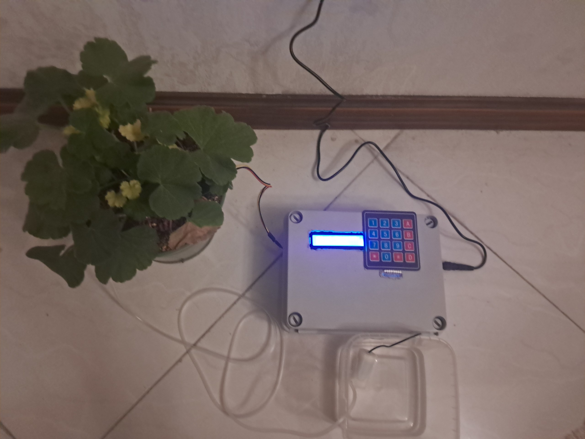
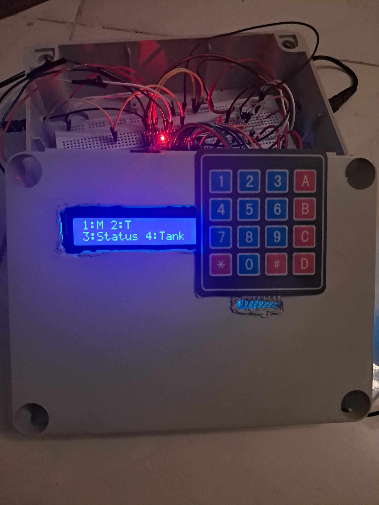

# Plant Watering System
An Arduino-based automatic plant watering system with configurable moisture-based and timer-based operation.
## Overview
We designed and built an Arduino-based automatic plant watering system that waters a plant according to user-configured settings. The system supports two operating modes: *moisture-based watering*, which uses a soil moisture sensor, and *timer-based watering*, which operates at a user-defined time interval.
## Features
### Moisture-based watering
Uses a soil moisture sensor to water the plant when the soil moisture falls below the user-defined threshold.
### Timer-based watering
Waters the plant at a user-defined time interval.
### Adjustable pump duration
Allows the user to define how long the water pump remains active during each watering session.
### Configurable tank capacity
Allows the user to set the capacity of the water tank so the system can estimate the remaining water.
### LCD interface
Displays system information, settings, and status messages through a 16×2 LCD.
### Keypad controls
Provides a 4×4 keypad for navigating the menu and configuring system parameters.
### Low-water warning
Monitors the estimated remaining water and warns the user when the tank level becomes too low to safely operate the pump.
## Hardware
- **Microcontroller:** Arduino Nano
- **Sensors:** Soil Moisture Sensor
- **Actuators:** Water Pump
- **Display:** 16×2 LCD with I2C interface
- **Input:** 4×4 Keypad
- **Switching:** Relay Module
- **Indicators:** LEDs
- **Power:** External Power Supply
## Software
**Programming Language:** C++
- **Development Environment:** PlatformIO
- **Simulation:** Proteus 
- **Data Storage:** EEPROM
- **Control Logic:** Finite State Machine (FSM)
## How the System Works
The system provides two watering modes: **Moisture Mode** and **Timer Mode**. In Moisture Mode, the Arduino continuously monitors the soil moisture sensor and compares the measured moisture level with a user-defined threshold. When the soil becomes sufficiently dry, the controller activates the water pump for the configured pump duration. In Timer Mode, watering is triggered according to a user-defined time interval rather than the soil moisture level. The user can configure the watering parameters through the 4×4 keypad, while the 16×2 LCD provides the corresponding menus, settings, and system status.  
The system also estimates the remaining amount in the water tank based on the pump's operation and tank capacity. A low-water warning is provided when the estimated remaining water falls below 250mL. User settings such as the operating mode, moisture threshold, watering interval, pump duration, and tank capacity are stored in EEPROM so that the configured values can be retained after the system is powered off. The software uses a finite state machine and non-blocking timing to allow the system to respond to user input and monitor its conditions while operating the pump.

## Circuit Schematic 

This is the design of the system, developed around an Arduino Nano microcontroller. We used a potentiometer to represent the moisture sensor input and a DC motor to simulate the water pump. A relay is used as a switching interface to safely control the pump motor without directly driving it from the microcontroller.
## Physical Prototype 
The final system was assembled as a functional prototype using a breadboard and jumper wires.

## Documentation
[Software Design Document](Software%20Design%20Document.pdf)
This pdf file is a detailed documentation of the system architecture, software design, finite state machine, and implementation details.
## Contributors
- **Pantea Mehdigholikhani**
- **Zeinab Mollaei**
- **Venus Jamali**

**Institution:** Sharif University of Technology  
